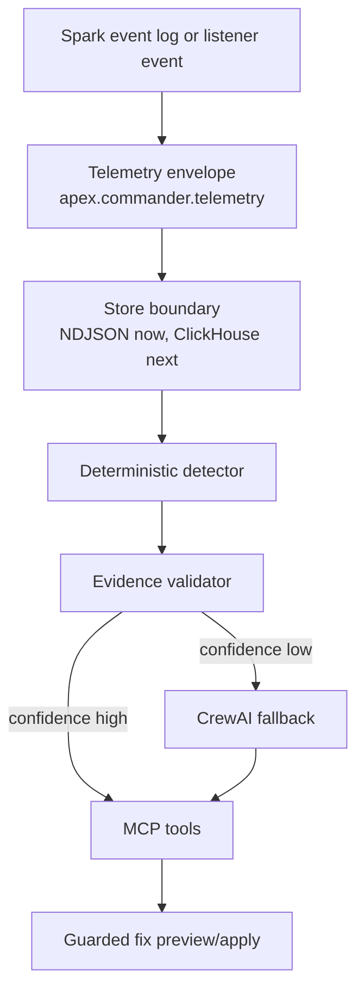

# Codex Desacoplamento Geradores Design

Date: 2026-07-09
Branch: `gustocezar/feature/codex-desacoplamento-geradores`
Prepared by: Codex

## Goal

Build a local Codex integration branch for the Luan/Commander V1 direction without changing the remote branch currently under review.

The branch should preserve the validated Commander harness and define a clean path to combine the updated `cowork`, `kimi`, and `spike/apex-v0.1` work without importing branch noise or destabilizing the evaluated branch.

## Recommended Approach

Use a selective integration strategy:

1. Keep the current local Commander harness as the contract boundary.
2. Absorb Cowork's V1 runtime pieces for ClickHouse ingest, CrewAI diagnosis, MCP tools, and guarded fix flow.
3. Absorb Kimi's validation discipline: deterministic T1, evidence validator, runbooks, and negative baseline.
4. Use Spike Apex v0.1 as architectural reference only.

This is better than a raw merge because the remote branches are large and reshape different parts of the repository. The Codex branch should make the intended solution reviewable before code from multiple branches is mixed.

## Alternatives Considered

### A. Merge `cowork` wholesale

Pros:

- Fastest way to show the Luan-style flow.
- Includes ClickHouse, CrewAI, MCP and `apply_fix`.

Cons:

- Very large diff.
- Includes tracked cache/archive/generated artifacts.
- Rewrites unrelated docs and root files.
- Listener is still a bridge rather than a true JVM listener.

Decision: do not merge wholesale.

### B. Merge `kimi` wholesale

Pros:

- Strong production direction.
- Good validation and runbook ideas.
- Adds Go core that can become V2.

Cons:

- Less immediate for the IDE/MCP product loop Luan asked to see.
- Adds a second runtime before V1 is stable.

Decision: use as validation source, not immediate runtime base.

### C. Use `spike/apex-v0.1` as the new root

Pros:

- Most complete standalone platform.
- Has Spark, MinIO, ClickHouse, HyperDX/ClickStack, detectors, CrewAI optional and MCP.

Cons:

- Huge restructure.
- Deletes/replaces many root files compared with the evaluated branch.
- Too risky while another branch is under review.

Decision: use as platform reference only.

## Architecture

The Codex branch uses two layers:

- Contract layer: the current `apex.commander` package, which turns event logs into telemetry and findings by `job_id`.
- Integration layer: future V1 modules that connect that contract to ClickHouse, MCP and optional agentic diagnosis.

## Module Boundaries

| Area | Responsibility | Current Source | Future Source |
| --- | --- | --- | --- |
| Telemetry contract | Normalize Spark evidence by `job_id` | Codex local harness | Keep |
| Store | Persist/query telemetry | NDJSON MVP | Cowork ClickHouse schema/ingest |
| T1 detector | Fast deterministic finding | Codex local harness | Kimi T1/runbooks |
| Evidence validation | Block weak or hallucinated findings | Not yet implemented | Kimi validator rules |
| CrewAI | Rich diagnosis when deterministic evidence is insufficient | Not yet implemented | Cowork `crew_diagnose.py` |
| MCP | IDE tools | CLI only | Cowork MCP, reduced to safe tools |
| Fix application | Human-approved code change | Not yet implemented | Cowork `apply_fix`, but default to preview/backup |

## Data Flow

1. Spark produces an event log or listener event stream.
2. Apex normalizes events into a telemetry envelope keyed by `job_id`.
3. The store persists the envelope.
4. A deterministic detector finds obvious patterns first.
5. The evidence validator checks required fields, thresholds, and false-positive controls.
6. CrewAI runs only if deterministic confidence is low or a richer explanation is requested.
7. MCP exposes the finding in the IDE.
8. `apply_fix` is opt-in and guarded by backup or patch preview.

## Safety Rules

- No push from this branch until explicitly requested.
- No automatic fix by default.
- No LLM call required for the basic diagnosis path.
- No raw merge of remote branches.
- No tracked caches, generated binary artifacts, or archive folders.
- Every imported runtime component must be behind a test.

## Initial Acceptance Criteria

- `pytest tests -q` passes locally.
- The Codex branch has no upstream by default.
- The branch contains a current reassessment of remote branches.
- The branch contains a task-level implementation plan.
- The first runtime milestone can diagnose a job by `job_id` without external services.
- Later milestones can add ClickHouse, CrewAI and MCP without breaking the local deterministic path.

## Review Note

This design is intentionally conservative. It gives Luan a branch with a clear direction while protecting the branch already under evaluation.
