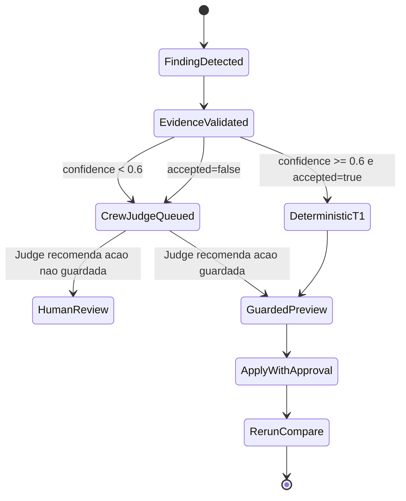
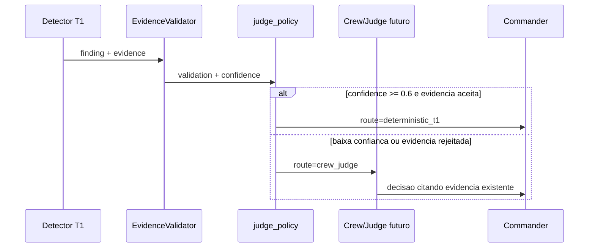

# Codex Crew/Judge Future Contract

Data: 2026-07-14

Escopo: desenhar a camada Crew.ai/Judge futura sem adicionar dependencia externa
e sem tornar LLM obrigatorio no caminho T1.

## Objetivo

A branch Codex ja provou o caminho deterministico rapido:

```text
event log -> detectores -> EvidenceValidator -> finding -> recomendacao -> preview/apply guardado -> rerun/compare
```

O papel da camada Crew/Judge nao e substituir esse caminho. O papel e atuar
somente quando a confianca ou a validade da evidencia nao forem suficientes
para uma acao deterministica segura.

## Decisao De Design

O T1 continua local, deterministico e sem LLM obrigatorio.

Uma politica local decide se um finding deve continuar no T1 ou ser escalado
para um futuro Judge:

```text
se confidence_score < 0.6 -> escalar para Crew/Judge
se EvidenceValidator rejeitou -> escalar para Crew/Judge
caso contrario -> manter deterministic_t1
```

Implementacao local:

- `apex/commander/judge_policy.py`
- `tests/test_commander_judge_policy.py`

Essa implementacao nao chama Crew.ai, OpenAI, API externa ou runtime agentico.
Ela apenas define o contrato de roteamento.

## Normalizacao De Confidence

| Valor Commander | Score |
|---|---:|
| `none` | 0.0 |
| `unknown` | 0.0 |
| `low` | 0.3 |
| `medium` | 0.6 |
| `high` | 0.85 |
| `critical` | 0.95 |

Valores numericos tambem sao aceitos e clampados para `[0.0, 1.0]`.

## Contrato Futuro Do Judge

Ferramenta futura sugerida:

```text
crew_judge_diagnose
```

Entradas obrigatorias:

- `job_id`
- `finding_kind`
- `confidence_score`
- `evidence`
- `validation`

Saidas obrigatorias:

- `decision`
- `rationale`
- `cited_evidence`
- `recommended_next_action`

Guardrail principal:

```text
judge_must_cite_existing_evidence
```

Ou seja: o Judge nao pode inventar uma causa. Ele deve citar evidencia que ja
existe no envelope, no ClickHouse/store, no validator ou no log do gate.

## Estados



## Fluxo



## Fora De Escopo Nesta Etapa

- instalar Crew.ai;
- chamar LLM;
- criar agentes reais;
- alterar MCP tools;
- mudar o comportamento dos gates G0-G5.

## Criterio De Aceite Local

- a politica e importavel sem dependencias externas;
- `confidence < 0.6` escala;
- `confidence == 0.6` permanece no T1;
- rejeicao do EvidenceValidator escala mesmo com confianca alta;
- testes locais passam para `tests/test_commander_judge_policy.py`.

