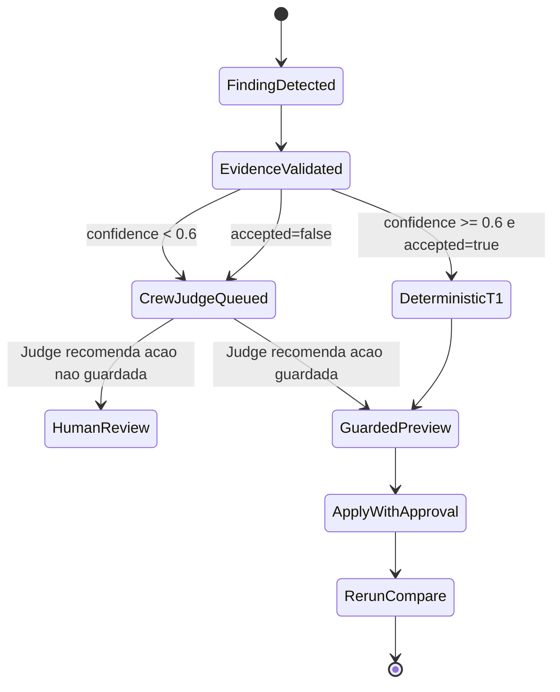
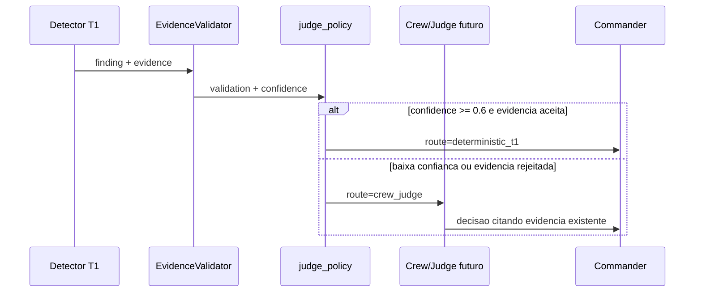

# Codex Crew/Judge Future Contract

Data: 2026-07-14

Escopo: desenhar a camada Crew.ai/Judge futura sem adicionar dependencia externa
e sem tornar LLM obrigatorio no caminho T1.

## Objetivo

A branch Codex ja provou o caminho deterministico rapido:

```text
event log -> detectores -> EvidenceValidator -> finding -> recomendacao -> preview/apply guardado -> rerun/compare
```

O papel da camada Crew/Judge nao e substituir esse caminho. O papel e atuar
somente quando a confianca ou a validade da evidencia nao forem suficientes
para uma acao deterministica segura.

Em outras palavras: Crew.ai/Judge e uma camada futura, opcional e posterior ao
`EvidenceValidator`. Ela nao entra no caminho quente T1, nao aumenta a latencia
obrigatoria e nao vira fonte primaria de verdade.

## Decisao De Design

O T1 continua local, deterministico e sem LLM obrigatorio.

Uma politica local decide se um finding deve continuar no T1 ou ser escalado
para um futuro Judge:

```text
se confidence_score < 0.6 -> escalar para Crew/Judge
se EvidenceValidator rejeitou -> escalar para Crew/Judge
caso contrario -> manter deterministic_t1
```

Implementacao local:

- `apex/commander/judge_policy.py`
- `tests/test_commander_judge_policy.py`

Essa implementacao nao chama Crew.ai, OpenAI, API externa ou runtime agentico.
Ela apenas define o contrato de roteamento.

## Politica De Escalonamento

Entrada da politica local:

- `finding`: envelope emitido pelos detectores T1;
- `validation`: resultado do `EvidenceValidator`, quando disponivel;
- `threshold`: limite numerico, com default `0.6`.

Saida da politica local:

- `status`: `keep_deterministic` ou `escalate`;
- `route`: `deterministic_t1` ou `crew_judge`;
- `should_escalate`: booleano para consumidores simples;
- `reasons`: lista auditavel, hoje limitada a:
  - `confidence_below_threshold`;
  - `evidence_validator_rejected`;
- `future_contract`: contrato estatico para a camada Crew/Judge futura.

Regras:

- `confidence_score < 0.6` escala para `crew_judge`;
- `confidence_score == 0.6` permanece em `deterministic_t1`;
- `validation.accepted == false` escala mesmo com confianca alta;
- ausencia de `validation` nao escala sozinha; nesse caso a politica decide
  apenas pela confianca normalizada.

O escalonamento nao significa "aplicar correcao". Significa "colocar uma
decisao em revisao enriquecida", ainda sujeita aos guardrails de preview,
approval token, apply guardado e rerun/compare.

## Normalizacao De Confidence

| Valor Commander | Score |
|---|---:|
| `none` | 0.0 |
| `unknown` | 0.0 |
| `low` | 0.3 |
| `medium` | 0.6 |
| `high` | 0.85 |
| `critical` | 0.95 |

Valores numericos tambem sao aceitos e clampados para `[0.0, 1.0]`.

## Contrato Futuro Do Judge

Ferramenta futura sugerida:

```text
crew_judge_diagnose
```

Entradas obrigatorias:

- `job_id`
- `finding_kind`
- `confidence_score`
- `evidence`
- `validation`

Entradas opcionais:

- `telemetry_window`
- `candidate_recommendations`
- `rerun_compare`

Saidas obrigatorias:

- `decision`
- `rationale`
- `cited_evidence`
- `recommended_next_action`
- `human_review_required`

Decisoes permitidas:

- `confirm_finding`
- `reject_finding`
- `request_more_evidence`
- `manual_review`

Guardrail principal:

```text
judge_must_cite_existing_evidence
```

Ou seja: o Judge nao pode inventar uma causa. Ele deve citar evidencia que ja
existe no envelope, no ClickHouse/store, no validator ou no log do gate.

## Restricoes Anti-Alucinacao

O Judge futuro deve operar como leitor de evidencia, nao como gerador livre de
diagnostico. O contrato local explicita estas restricoes:

- `must_cite_existing_evidence`: toda decisao deve apontar para campos,
  metricas, issues do validator ou eventos existentes;
- `must_not_invent_metrics`: nenhum valor numerico pode aparecer sem existir na
  entrada, store ou comparacao de rerun;
- `must_not_invent_root_cause`: causa raiz so pode ser afirmada quando a
  evidencia a sustenta; caso contrario, usar incerteza explicita;
- `must_mark_unknown_when_evidence_is_missing`: evidencia ausente deve produzir
  `request_more_evidence` ou `manual_review`, nao uma conclusao confiante;
- `must_not_apply_changes_directly`: o Judge nao altera arquivos, jobs ou
  configuracoes. Ele so recomenda o proximo passo.

Qualquer recomendacao de mudanca continua passando pelo fluxo existente de
preview/apply guardado. Se a acao nao couber nesse fluxo, a saida deve marcar
`human_review_required=true`.

## Encaixe Depois De T1/EvidenceValidator

1. Detector T1 emite `finding` com `kind`, `job_id`, `confidence` e `evidence`.
2. `EvidenceValidator` valida schema, proveniencia minima e campos especificos
   do tipo de finding.
3. `judge_policy` normaliza confidence e decide a rota.
4. Se a rota for `deterministic_t1`, o Commander segue para recomendacao,
   preview/apply guardado e rerun/compare.
5. Se a rota for `crew_judge`, uma implementacao futura podera chamar
   `crew_judge_diagnose` com o envelope validado/rejeitado e suas issues.
6. A resposta do Judge so pode confirmar, rejeitar, pedir mais evidencia ou
   mandar para revisao manual. Ela nao substitui o validator nem aplica fix.

## Estados



## Fluxo



## Fora De Escopo Nesta Etapa

- instalar Crew.ai;
- chamar LLM;
- criar agentes reais;
- alterar MCP tools;
- mudar o comportamento dos gates G0-G5.

## Criterio De Aceite Local

- a politica e importavel sem dependencias externas;
- `confidence < 0.6` escala;
- `confidence == 0.6` permanece no T1;
- rejeicao do EvidenceValidator escala mesmo com confianca alta;
- testes locais passam para `tests/test_commander_judge_policy.py`.
