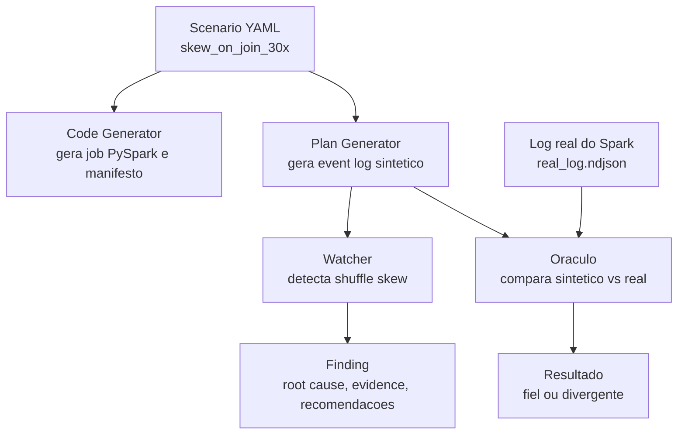
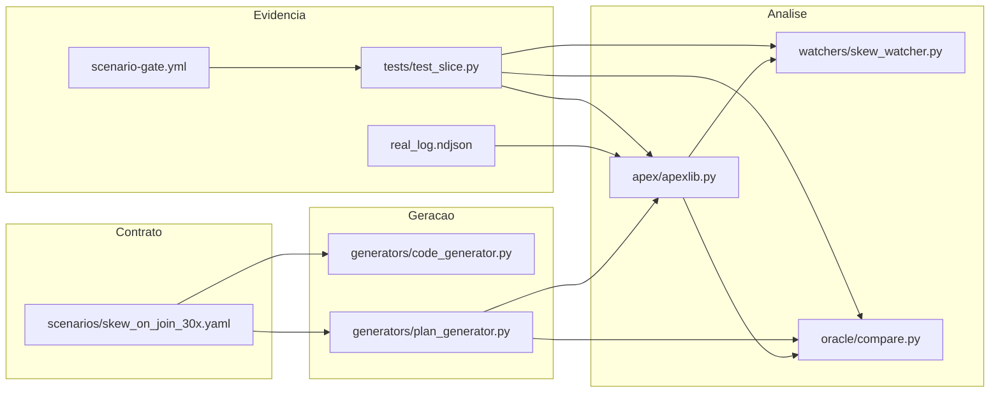

# Guia de Validacao para a Crew A

Este guia ajuda o time a revisar o slice `skew_on_join_30x` v4 corrigido sem depender de leitura profunda do codigo. Ele organiza a conversa em quatro perguntas:

1. O que foi feito?
2. Como foi feito?
3. Que evidencia prova que funciona?
4. Podemos seguir nessa direcao?

## Resumo para abrir a conversa

O Apex precisa diagnosticar problemas de performance Spark usando evidencias de execucao. Neste slice, validamos um primeiro caso: skew em join.

O trabalho prova que conseguimos partir de um contrato declarativo, gerar um log sintetico, detectar o anti-pattern com um Watcher e comparar esse sintetico contra um log real do Spark.

Resultado atual:

```text
synthetic ratio: 27.9x
real ratio:      29.5x
watcher:         GATE VERDE
oracle:          sintetico fiel ao Spark real dentro da tolerancia
```

## Glossario rapido

| Termo | Explicacao simples |
|---|---|
| Scenario | Arquivo YAML que descreve o problema que queremos simular. |
| Event log | Registro nativo do Spark com eventos da execucao do job. |
| Log sintetico | Event log gerado pelo Apex sem rodar Spark, seguindo o scenario. |
| Log real | Event log produzido por uma execucao real do Spark. |
| Watcher | Componente que observa o log e detecta um problema. |
| Finding | Resultado emitido pelo Watcher com causa, evidencia e recomendacao. |
| Oraculo | Comparador que valida se o sintetico parece fiel ao log real. |
| Provenance | Cadeia de custodia que prova que o log veio do scenario esperado. |
| Skew | Quando uma particao recebe trabalho muito maior que as outras. |

## Fluxo do slice



Leitura do fluxo:

1. O `scenario.yaml` e a fonte de verdade.
2. O `code_generator.py` mostra qual job real poderia produzir aquele comportamento.
3. O `plan_generator.py` cria um event log sintetico com o mesmo contrato.
4. O `skew_watcher.py` detecta o problema no log.
5. O `oracle/compare.py` compara o sintetico com o log real versionado.

## Arquitetura atual



Ponto importante para decisao de arquitetura:

```text
Spark job real -> event log nativo do Spark -> Apex externo -> Finding
```

O slice preserva o contrato nao-intrusivo:

- sem JAR customizado;
- sem listener injetado no cliente;
- sem alterar `SparkSession` do cliente;
- sem acoplar Apex ao ciclo de vida do job Spark.

## O que a v4 corrigiu

A versao anterior detectava skew, mas o sintetico exagerava o problema:

```text
synthetic ratio antigo: 15392.3x
real ratio:             29.5x
```

A v4 corrigiu a distribuicao do log sintetico:

```text
rows = 200000
hot_share = 0.80
shuffle_partitions = 8
hot_records ~= 160000
cold_each ~= 5714
ratio sintetico ~= 27.9x
```

Com isso, o Watcher continua detectando o problema, e o Oraculo passa a validar que o sintetico representa o Spark real dentro da tolerancia.

## Como validar em grupo

Use esta ordem na reuniao:

1. Abrir o problema: Apex precisa diagnosticar problemas Spark com evidencias, nao com chute.
2. Mostrar o contrato: `scenarios/skew_on_join_30x.yaml`.
3. Mostrar o fluxo: scenario -> log sintetico -> watcher -> oracle -> log real.
4. Rodar ou mostrar os comandos do playbook.
5. Ler o Finding emitido pelo Watcher.
6. Comparar `27.9x` sintetico contra `29.5x` real.
7. Separar o que esta provado do que ainda e proximo passo.

## O que esta provado

| Ponto | Status |
|---|---|
| Scenario declarativo para skew | Provado no slice atual |
| Event log sintetico gerado sem Spark | Provado no slice atual |
| Watcher deterministico de skew | Provado no slice atual |
| Comparacao com log real | Provado no slice atual |
| Testes automatizados | Provado no slice atual |
| Gate inicial de CI | Provado no slice atual |

## O que ainda nao esta provado

| Ponto | Motivo |
|---|---|
| Todos os anti-patterns do Apex | O slice cobre apenas skew em join. |
| Falso positivo sem skew | Falta `no_skew_baseline.yaml`. |
| Confidence madura | A confianca atual ainda e simples. |
| Persistencia em ClickHouse | A prova atual usa arquivos versionados. |
| Comentario automatico em PR | Existe gate inicial, mas nao comentario de review. |
| Core em Go | A prova atual usa Python como laboratorio e spec executavel. |

## Decisoes que o time precisa tomar

### 1. Caminho do slice

Decidir se o time aceita este slice como primeira referencia de trabalho para Apex.

Opcao recomendada:

```text
Aceitar como prova de conceito validada e evoluir em pequenos slices.
```

### 2. Governanca do fork

Decidir como tratar `dataship-spark-plat-v0`.

Opcao recomendada:

```text
Manter o fork como repo de evidencia reproduzivel e levar para Apex apenas a parte curada.
```

### 3. Contrato nao-intrusivo

Confirmar que Apex deve observar event logs nativos do Spark sem modificar o ambiente do cliente.

Opcao recomendada:

```text
Manter coleta nao-intrusiva como regra de arquitetura.
```

### 4. Proximos passos tecnicos

Priorizar depois da validacao:

1. Criar `scenarios/no_skew_baseline.yaml`.
2. Adicionar `validation_criteria` ao scenario.
3. Melhorar `confidence` com evidencia real.
4. Criar Action semanal do Oraculo contra log real versionado.
5. Desenhar schema ClickHouse para Findings.

## Roteiro para apresentacao

Tempo sugerido: 15 a 20 minutos.

| Tempo | Tema | Mensagem |
|---|---|---|
| 2 min | Contexto | Apex precisa diagnosticar Spark com base em event logs. |
| 3 min | Problema | Skew em join causa particao quente e execucao desbalanceada. |
| 4 min | Solucao | Scenario gera log sintetico, Watcher detecta, Oraculo compara com real. |
| 4 min | Evidencia | Ratio sintetico 27.9x contra real 29.5x. |
| 3 min | Arquitetura | Apex fica externo, lendo event log nativo. |
| 4 min | Decisao | Time decide se segue com slices pequenos e validados. |

## Como o capitao pode conduzir

Como capitao, seu papel aqui e separar aprendizado de decisao.

Frase boa para abrir:

```text
O objetivo hoje nao e dizer que o Apex esta pronto. O objetivo e validar se esta fatia prova o caminho: contrato declarativo, evidencia reproduzivel, Watcher deterministico e comparacao com log real.
```

Frase boa para fechar:

```text
Se o time concordar com esta abordagem, o proximo passo nao e aumentar o escopo. O proximo passo e repetir o mesmo padrao com baseline sem skew e criterios de validacao mais claros.
```

