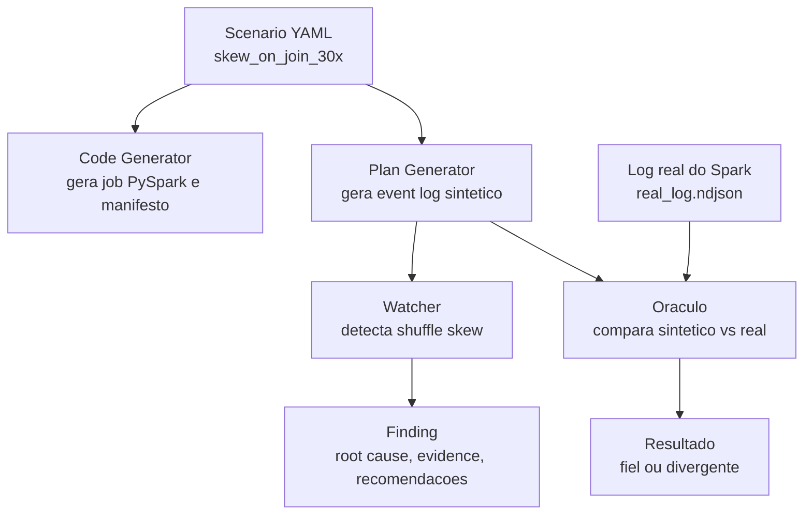
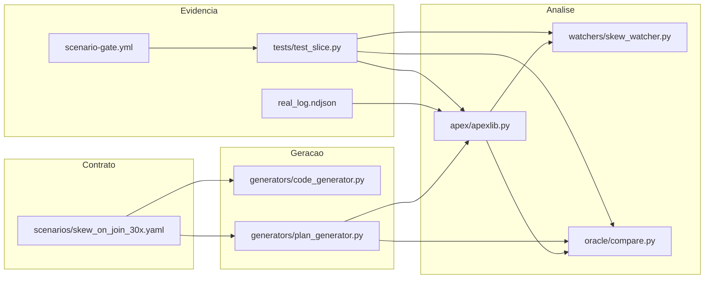
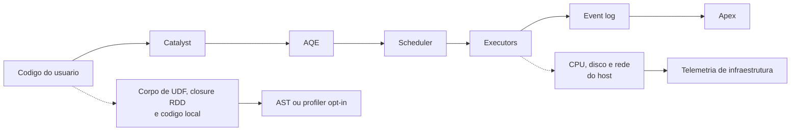
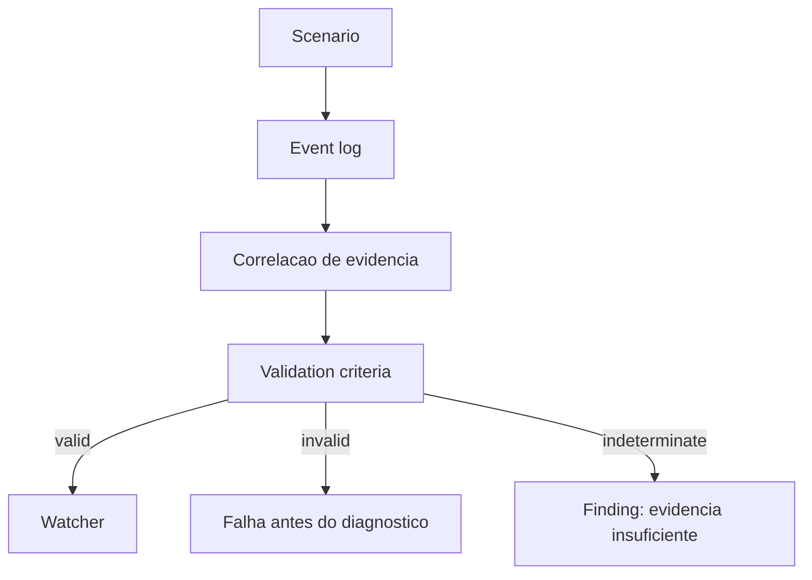
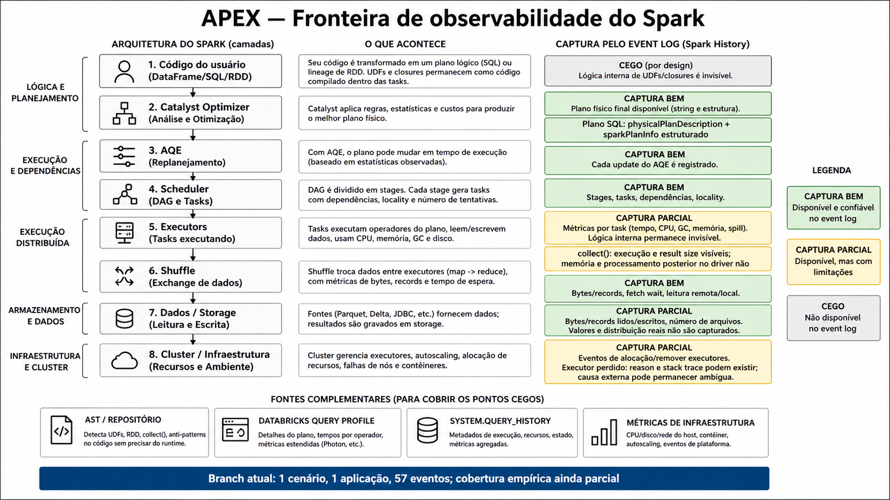

# Guia de Validacao para a Crew A

Este guia ajuda o time a revisar o slice `skew_on_join_30x` v4 corrigido sem depender de leitura profunda do codigo. Ele organiza a conversa em quatro perguntas:

1. O que foi feito?
2. Como foi feito?
3. Que evidencia prova que funciona?
4. Podemos seguir nessa direcao?

## Resumo para abrir a conversa

O Apex precisa diagnosticar problemas de performance Spark usando evidencias de execucao. Neste slice, validamos um primeiro caso: skew em join.

O trabalho prova que conseguimos partir de um contrato declarativo, gerar um log sintetico, detectar o anti-pattern com um Watcher e comparar esse sintetico contra um log real do Spark.

Resultado atual:

```text
synthetic ratio: 27.9x
real ratio:      29.5x
watcher:         GATE VERDE
oracle:          sintetico fiel ao Spark real dentro da tolerancia
```

O estudo de cobertura acrescenta uma segunda pergunta para o time:

```text
Quais diagnosticos o event log consegue sustentar, e quais precisam de outra fonte?
```

## Glossario rapido

| Termo | Explicacao simples |
|---|---|
| Scenario | Arquivo YAML que descreve o problema que queremos simular. |
| Event log | Registro nativo do Spark com eventos da execucao do job. |
| Log sintetico | Event log gerado pelo Apex sem rodar Spark, seguindo o scenario. |
| Log real | Event log produzido por uma execucao real do Spark. |
| Watcher | Componente que observa o log e detecta um problema. |
| Finding | Resultado emitido pelo Watcher com causa, evidencia e recomendacao. |
| Oraculo | Comparador que valida se o sintetico parece fiel ao log real. |
| Provenance | Cadeia de custodia que prova que o log veio do scenario esperado. |
| Skew | Quando uma particao recebe trabalho muito maior que as outras. |
| Inventario de cobertura | Script que lista o que o Spark emitiu e o que o Apex usa. |
| Catalyst | Componente do Spark que analisa e otimiza planos SQL/DataFrame. |
| AQE | Adaptive Query Execution; ajusta o plano durante a execucao. |
| AST | Estrutura do codigo usada para localizar padroes sem executar o job. |
| Validation criteria | Regras que confirmam se o log possui qualidade suficiente antes do Watcher. |

## Fluxo do slice



Leitura do fluxo:

1. O `scenario.yaml` e a fonte de verdade.
2. O `code_generator.py` mostra qual job real poderia produzir aquele comportamento.
3. O `plan_generator.py` cria um event log sintetico com o mesmo contrato.
4. O `skew_watcher.py` detecta o problema no log.
5. O `oracle/compare.py` compara o sintetico com o log real versionado.

## Arquitetura atual



Ponto importante para decisao de arquitetura:

```text
Spark job real -> event log nativo do Spark -> Apex externo -> Finding
```

O slice preserva o contrato nao-intrusivo:

- sem JAR customizado;
- sem listener injetado no cliente;
- sem alterar `SparkSession` do cliente;
- sem acoplar Apex ao ciclo de vida do job Spark.

## O que o event log permite observar



O event log captura bem jobs, stages, tasks, planos e metricas. Ele mostra a
presenca de uma UDF, mas nao o corpo da funcao. Em RDD, ele registra lineage,
scope e callsite, mas nao a closure executada.

Para a leitura completa, use a
[fronteira de observabilidade](architecture/event-log-observability-boundary.md).
Para navegar do produto ate cada metrica e chamada do slice, use o
[drill-down completo](architecture/apex-solution-drilldown.md).

## O que o inventario v1 descobriu

O script analisou uma aplicacao com 57 eventos e 18 tipos de evento:

| Classe | Resultado | Leitura |
|---|---:|---|
| A | 7 campos | O Apex atual ja consome |
| B* | 32 caminhos | Sinais valiosos presentes, ainda sem consumo |
| B | 254 caminhos | Outros campos observados |

Os 32 caminhos B* nao representam 32 features. Eles agrupam sinais como spill,
CPU, GC, shuffle write, RDD Info e `sparkPlanInfo`.

O achado mais pratico para a Crew A:

```text
spill, CPU time, GC, input e shuffle write ja estao no log;
o trabalho futuro e parsing, Watcher e validacao.
```

O corpus real atual ainda nao exercita UDF, streaming, AQE update, spill real,
retry ou perda de executor. Retries, speculation e zeros possuem testes
adversariais deterministas, mas ainda precisam de corpus real.

## Estado das skills e componentes futuros

O estudo cita WarpGrep, AST Classifier, CodeGrounder, RAG e Tier 2. Esses nomes
nao representam diagnosticos validados.

| Item | Estado correto |
|---|---|
| WarpGrep | Ferramenta instalada para apoiar busca; nao testada como parte do Apex |
| stop-slop | Usada para revisar o texto da documentacao |
| Mermaid e imagegen | Usados para produzir material visual |
| AST Classifier | Proposta para analisar UDF, RDD e `collect()` no codigo |
| CodeGrounder | Proposta para ligar evidencia a arquivo e linha |
| RAG no ClickHouse | Sugestao para recuperar casos e contexto |
| Tier 2 | Proposto e ainda bloqueado por falta de evidencia |

O diagnostico comprovado continua sendo `skew_on_join_30x`. O inventario de
cobertura tambem foi executado, mas ele mede campos; ele nao diagnostica novos
anti-patterns.

## Proposta de `validation_criteria`

O scenario atual ja declara o comportamento esperado e o Finding minimo. Falta
um gate que rejeite logs incompletos ou distribuicoes artificiais antes do
Watcher.



Exemplos de criterios em discussao:

- exigir os eventos de SQL, stage e task;
- exigir oito tasks com trabalho no stage alvo;
- rejeitar colapso em uma unica task;
- exigir mediana fria maior que zero;
- deduplicar retry e tentativa especulativa;
- preservar particoes com zero para nao criar falso colapso;
- correlacionar operador e stage por IDs e acumuladores;
- isolar eventos por aplicacao e manter agregacao incremental;
- comparar particao quente e tipo de task entre sintetico e real;
- confirmar o operador `SortMergeJoin`;
- exigir ratio minimo no scenario de skew;
- exigir ratio maximo no baseline sem skew.

A proposta completa esta em
[`specs/scenario-validation-criteria-v1.md`](specs/scenario-validation-criteria-v1.md).
O schema ainda nao altera o scenario, mas attempts, zeros, estados de evidencia
e correlacao por acumuladores ja executam no `apexlib` e no Watcher.

Os desenhos completos de fluxo, arquitetura, sequencia, cadeia de valor,
gargalos e pontos de ruptura estao em
[`architecture/validation-evidence-flow.md`](architecture/validation-evidence-flow.md).

## Visao visual para a reuniao



Use esta imagem para explicar as camadas do Spark e a fronteira do event log. Em
seguida, abra o
[drill-down completo](architecture/apex-solution-drilldown.md) para mostrar os
fluxos macro, os componentes, a sequencia validada e a arquitetura alvo.

## O que a v4 corrigiu

A versao anterior detectava skew, mas o sintetico exagerava o problema:

```text
synthetic ratio antigo: 15392.3x
real ratio:             29.5x
```

A v4 corrigiu a distribuicao do log sintetico:

```text
rows = 200000
hot_share = 0.80
shuffle_partitions = 8
hot_records ~= 160000
cold_each ~= 5714
ratio sintetico ~= 27.9x
```

Com isso, o Watcher continua detectando o problema, e o Oraculo passa a validar que o sintetico representa o Spark real dentro da tolerancia.

## Como validar em grupo

Use esta ordem na reuniao:

1. Abrir o problema: Apex precisa diagnosticar problemas Spark com evidencias, nao com chute.
2. Mostrar o contrato: `scenarios/skew_on_join_30x.yaml`.
3. Mostrar o fluxo: scenario -> log sintetico -> watcher -> oracle -> log real.
4. Rodar ou mostrar os comandos do playbook.
5. Ler o Finding emitido pelo Watcher.
6. Comparar `27.9x` sintetico contra `29.5x` real.
7. Separar o que esta provado do que ainda e proximo passo.
8. Mostrar o inventario e separar campo disponivel de ponto cego real.
9. Abrir o drill-down e marcar o que esta validado, observado ou proposto.
10. Revisar a proposta de `validation_criteria` e decidir quem implementa o gate.
11. Revisar os pontos de ruptura e atribuir cada controle a um pod.

## O que esta provado

| Ponto | Status |
|---|---|
| Scenario declarativo para skew | Provado no slice atual |
| Event log sintetico gerado sem Spark | Provado no slice atual |
| Watcher deterministico de skew | Provado em confirmacao controlada; descoberta cega ainda nao |
| Comparacao com log real | Provado no slice atual |
| Testes automatizados | Provado no slice atual |
| Gate inicial de CI | Provado no slice atual |
| Inventario reproduzivel de campos | Provado sobre o corpus v1 |
| Campos de spill presentes no log | Observados com valor zero; falta scenario com spill real |
| Attempts e zeros | Provados por testes adversariais |
| Correlacao operador-stage | Provada no log real pelo acumulador 45 do `SortMergeJoin` |
| Portabilidade dos CLIs | Provada com output `cp1252` sem erro Unicode |

## O que ainda nao esta provado

| Ponto | Motivo |
|---|---|
| Todos os anti-patterns do Apex | O slice cobre apenas skew em join. |
| Falso positivo sem skew | Falta `no_skew_baseline.yaml`. |
| Retries e tasks especulativas reais | A regra esta testada, mas o corpus real nao contem esses eventos. |
| Correlacao em logs sem acumuladores | O fallback e exposto, mas nao resolve o vinculo. |
| Processamento streaming ponta a ponta | O reader possui iterador, mas Watcher e Oraculo materializam o log. |
| Fidelidade estrutural do sintetico | O real usa hot partition 3 e `ResultTask`; o sintetico usa 0 e `ShuffleMapTask`. |
| Descoberta cega | O Watcher atual le chave e valor do scenario. |
| Confidence madura | A confianca atual ainda e simples. |
| Persistencia em ClickHouse | A prova atual usa arquivos versionados. |
| Comentario automatico em PR | Existe gate inicial, mas nao comentario de review. |
| Core em Go | A prova atual usa Python como laboratorio e spec executavel. |
| Cobertura completa do event log | O corpus atual contem uma aplicacao. |
| Diagnostico da logica interna de UDF | O event log nao inclui o corpo executado. |
| Cobertura de Serverless | Exige Query Profile ou system tables. |

## Decisoes que o time precisa tomar

### 1. Caminho do slice

Decidir se o time aceita este slice como primeira referencia de trabalho para Apex.

Opcao recomendada:

```text
Aceitar como prova de conceito validada e evoluir em pequenos slices.
```

### 2. Governanca do fork

Decidir como tratar `dataship-spark-plat-v0`.

Opcao recomendada:

```text
Manter o fork como repo de evidencia reproduzivel e levar para Apex apenas a parte curada.
```

### 3. Contrato nao-intrusivo

Confirmar que Apex deve observar event logs nativos do Spark sem modificar o ambiente do cliente.

Opcao recomendada:

```text
Manter coleta nao-intrusiva como regra de arquitetura.
```

### 4. Proximos passos tecnicos

Priorizar depois da validacao:

1. Criar `scenarios/no_skew_baseline.yaml`.
2. Aprovar o schema e extrair o gate para `Evidence Validator`.
3. Tornar Watcher e Oraculo incrementais e isolados por aplicacao.
4. Corrigir ou declarar a divergencia de hot partition e task type no sintetico.
5. Separar descoberta cega de confirmacao por scenario.
6. Melhorar `confidence` com qualidade e cobertura da evidencia.
7. Criar Action semanal do Oraculo contra logs reais versionados.
8. Desenhar schema ClickHouse para referencias, evidencias e Findings.
9. Montar corpus real com retry, speculation, RDD, UDF, streaming, falha e spill.
10. Priorizar os sinais B* antes de criar nova coleta.

## Roteiro para apresentacao

Tempo sugerido: 20 a 25 minutos.

| Tempo | Tema | Mensagem |
|---|---|---|
| 2 min | Contexto | Apex precisa diagnosticar Spark com base em event logs. |
| 3 min | Problema | Skew em join causa particao quente e execucao desbalanceada. |
| 4 min | Solucao | Scenario gera log sintetico, Watcher detecta, Oraculo compara com real. |
| 4 min | Evidencia | Ratio sintetico 27.9x contra real 29.5x. |
| 3 min | Arquitetura | Apex fica externo, lendo event log nativo. |
| 4 min | Decisao | Time decide se segue com slices pequenos e validados. |
| 4 min | Cobertura | Separar sinais disponiveis, lacunas do corpus e pontos cegos. |

## Como o capitao pode conduzir

Como capitao, seu papel aqui e separar aprendizado de decisao.

Frase boa para abrir:

```text
O objetivo hoje nao e dizer que o Apex esta pronto. O objetivo e validar se esta fatia prova o caminho: contrato declarativo, evidencia reproduzivel, Watcher deterministico e comparacao com log real.
```

Frase boa para fechar:

```text
Se o time concordar com esta abordagem, o proximo passo nao e aumentar o escopo. O proximo passo e repetir o mesmo padrao com baseline sem skew e criterios de validacao mais claros.
```
